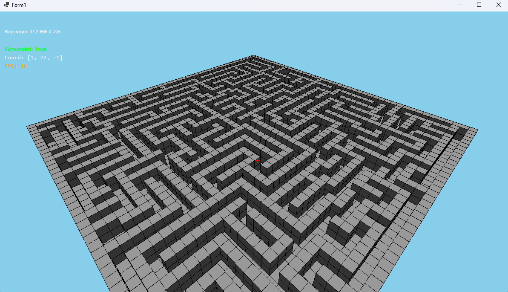
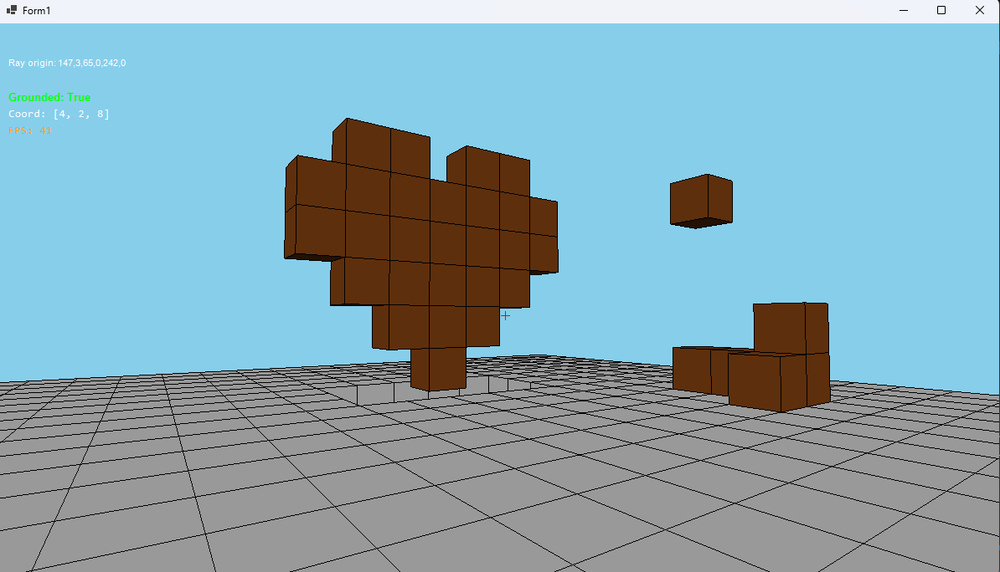
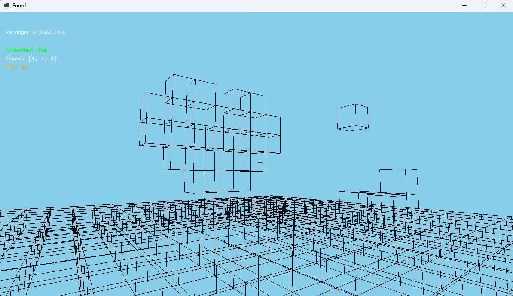

# Pure-CSharp-Forms-Minecraft

[](https://dotnet.microsoft.com/download/dotnet/8.0)
[](https://docs.microsoft.com/en-us/dotnet/csharp/)
[](https://opensource.org/licenses/MIT)
[](https://github.com/aliumutidiz/Pure-CSharp-Forms-Minecraft/issues)
[](CONTRIBUTING.md)

Hi there! **Pure-CSharp-Forms-Minecraft** is a 3D block-based game inspired by Minecraft, built entirely from scratch using C# and Windows Forms, without any game engine. Right now, it focuses on placing and removing blocks with a first-person view, but it’s a work in progress. I’m excited to keep developing it to add features like world generation, free exploration, and more. If you’re into C# or curious about game development, I hope you’ll check it out and maybe even join me in improving it!



---

## Table of Contents
- [About the Project](#about-the-project)
- [Features](#features)
- [Screenshots](#screenshots)
- [Prerequisites](#prerequisites)
- [Installation](#installation)
- [Usage](#usage)
- [Controls](#controls)
- [Technical Details](#technical-details)
- [Project Structure](#project-structure)
- [Future Plans](#future-plans)
- [Contributing](#contributing)
- [License](#license)
- [Acknowledgements](#acknowledgements)
- [Contact](#contact)

---

## About the Project
This project is my attempt to recreate some of Minecraft’s core mechanics using only **C#** and **Windows Forms**, without relying on a dedicated game engine. At its current stage, it lets you place and remove blocks in a 3D space, viewed from a first-person perspective. There’s no automatic world generation yet, so the environment starts with a basic flat terrain, but the foundation for a fully interactive 3D world is there. I built this to challenge myself and learn more about 3D rendering and game logic directly in C#. I’m planning to expand it with features like terrain generation and smoother gameplay, and I’d love for others to join in or share ideas! It’s all about the fun of creating something from scratch.

---

## Features
* **Block Placement and Removal**: Add or delete blocks with customizable colors. Just left-click to remove and right-click to place.
* **First-Person Camera**: Look around with mouse controls and move using **W, A, S, D**. You can **Space** to jump.
* **Basic Collision Detection**: Blocks have simple collision, so you can't walk through them!
* **Basic Lighting**: Simple directional lighting for block shading, giving the world a bit more depth.
* **Wireframe Mode**: Toggle for a debug view of block outlines with the **Middle Mouse Button**.
* **Performance Tracking**: Displays **FPS** and player coordinates (**[X, Y, Z]**) in a helpful HUD.
* **Dynamic View Range**: Increase or decrease the chunk render range using **+** and **-** keys to see more or less of the world.
* **Block Outlines**: Toggle block edge rendering with the **X** key.
* **Background Toggle**: Switch between a sky blue and black background using the **B** key, kind of like a simple day/night cycle.
* **Early Chunk System**: An initial implementation for managing blocks efficiently in chunks, laying the groundwork for larger worlds.

---

## Screenshots
| Block Placement | Wireframe Mode | Maze Map Load (TEST) |
|:---------------:|:--------------:|:-------------------:|
|  |  |  |

*Note*: A demo video is coming soon to show the game in action! For now, check out the screenshots above.

---

## Prerequisites
* **.NET 8.0 SDK**: Needed to build and run the project. You can download it [here](https://dotnet.microsoft.com/download/dotnet/8.0).
* **Visual Studio 2022 (or later)**: The recommended IDE for developing and running the project. Download it [here](https://visualstudio.microsoft.com/).
* **Windows OS**: The game uses Windows Forms, which is a Windows-specific technology.
* **Git**: To clone the repository from GitHub. You can download Git [here](https://git-scm.com/).

---

## Installation
1.  **Clone the Repository**:
    Open your terminal or Git Bash and run:
    ```bash
    git clone [https://github.com/aliumutidiz/Pure-CSharp-Forms-Minecraft.git](https://github.com/aliumutidiz/Pure-CSharp-Forms-Minecraft.git)
    cd Pure-CSharp-Forms-Minecraft
    ```
2.  **Open the Solution**:
    Navigate to the cloned directory and open `Pure-CSharp-Forms-Minecraft.sln` in **Visual Studio 2022**.
3.  **Restore Dependencies**:
    Visual Studio will usually restore NuGet packages automatically. If not, you can right-click the solution in Solution Explorer and select "Restore NuGet Packages," or run the following command in the project directory:
    ```bash
    dotnet restore
    ```
4.  **Build and Run**:
    Press `F5` in Visual Studio to build and run the project, or use the command line:
    ```bash
    dotnet run
    ```

---

## Usage
* Once the game starts, you'll find yourself in a 3D space with a flat initial terrain.
* Use your mouse to look around and aim at blocks to interact with them.
* Experiment with placing and removing blocks to build simple structures.
* Try toggling **wireframe mode** or adjusting the **chunk range** to see the rendering in action!
* Since there's no complex world generation yet, it's a perfect sandbox for experimenting with block manipulation.

---

## Controls
| Key             | Action                                |
|-----------------|---------------------------------------|
| `W`             | Move forward                          |
| `A`             | Move left                             |
| `S`             | Move backward                         |
| `D`             | Move right                            |
| `Space`         | Jump                                  |
| `Left Click`    | Remove block                          |
| `Right Click`   | Place block                           |
| `Middle Click`  | Toggle wireframe mode                 |
| `Z`             | Toggle block face visibility          |
| `B`             | Toggle background (sky blue / black)  |
| `+` / `-`       | Increase/decrease chunk render range  |
| `X`             | Toggle block outline rendering        |

---

## Technical Details
This project is a deep dive into building a 3D game with minimal tools, primarily focusing on core concepts:
* **3D Rendering**: Utilizes `System.Drawing.Graphics` to handle all rendering, effectively drawing 3D cubes as 2D polygons on the screen in real-time. This includes manual perspective projection and back-face culling.
* **Vector Math**: Extensive use of `System.Numerics.Vector3` and `System.Numerics.Matrix4x4` for camera transformations, lighting calculations, and general 3D geometry.
* **Raycasting**: Implements a custom raycasting algorithm to accurately detect which block the player is looking at for interactions like placement and removal.
* **Chunk System (Early Stage)**: An initial setup to manage blocks within logical "chunks" of the world, aiming to improve performance for larger environments.
* **Physics Simulation**: Includes basic gravity application and collision detection to ensure the player interacts realistically with the environment.
* **Basic Lighting Model**: A simple directional lighting model is applied to block faces based on their normal vectors and a fixed light source, providing a sense of depth.

---

## Project Structure
```
Pure-CSharp-Forms-Minecraft/
├── Minecraft.sln  # Solution file
├── Minecraft/     # Main project folder
│   ├── Form1.cs                     # Core game logic
│   ├── Program.cs                   # Application entry point
│   ├── Maze.cs                      # Maze loading logic (TEST)
│   ├── LoadMap.cs                   # Map loading logic (TEST)
├── screenshots/                     # Screenshots and demo media
├── README.md                        # This documentation
├── LICENSE                          # MIT License
├── .gitignore                       # Visual Studio ignore file
├── CONTRIBUTING.md                  # Contribution guidelines
```

---

## Future Plans

I'm excited to keep working on this project! Here's what I'm hoping to explore and gradually add in the future:

* **World Generation**: My top priority is to start experimenting with procedural world generation. It would be awesome to create varied terrains instead of just a flat base.
* **More Block Types & Textures**: Adding different kinds of blocks like dirt, stone, or wood, and giving them simple textures to make the world feel more alive.
* **Improved Movement & Collisions**: Making the player movement feel smoother and refining the collision detection for a better experience.
* **Basic Inventory**: A simple way to keep track of blocks you pick up or want to place.
* **Performance Tweaks**: As the world gets bigger, I'll definitely be looking into ways to make rendering more efficient to keep things running smoothly.
* **Sound Effects**: Adding some basic sounds for interactions, like placing or breaking blocks, to make it more engaging.

If you have ideas or want to help, I'd love to hear from you!

---

## Contributing
I’d be thrilled to have others contribute to this project! Whether you're fixing bugs, adding new features, or improving documentation, every contribution is welcome. To get started:
1.  **Fork** the repository.
2.  **Clone** your forked repository to your local machine.
3.  **Create a new branch** for your feature or bug fix (`git checkout -b feature/your-feature`).
4.  **Make your changes** and commit them (`git commit -m "Add your feature"`).
5.  **Push** your changes to your new branch (`git push push origin feature/your-feature`).
6.  **Open a Pull Request** against the `main` branch of this repository.

---

## License
This project is licensed under the **MIT License**. You can find the full license text in the [LICENSE](LICENSE) file in this repository. This means you are free to use, modify, and distribute this software for personal or commercial purposes, provided you include the original copyright and license notice.

---

## Acknowledgements
* Inspired by the incredible game **Minecraft** by Mojang Studios.
* Built entirely with **C#** and the **.NET 8.0** framework.
* Thanks to the open-source community and countless online resources that make learning and building projects like this possible.

---

## Contact
Got questions, suggestions, or just want to chat about the project? Feel free to reach out:
* **GitHub Issues**: The best way to report bugs or suggest features is by [opening an issue](https://github.com/aliumutidiz/Pure-CSharp-Forms-Minecraft/issues) on this repository.
* **GitHub Profile**: You can also reach me directly through my GitHub profile: [aliumutidiz](https://github.com/aliumutidiz).

Thanks for checking out my project—happy coding!
